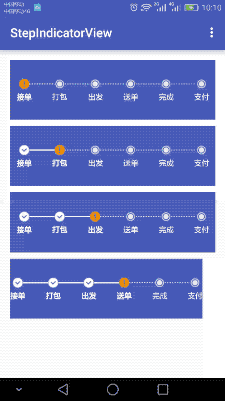

StepIndicatorView (流程指示器)
-----------------------------


SnapShot
-------------------



Sample
---------------------------
> Please look at the [app](https://github.com/gemingxing/StepIndicatorView/tree/master/app) module


StepUp
------------------------------
First, add jitpack in your build.gradle at the end of repositories:

```
repositories {
    // ...
    maven { url "https://jitpack.io" }
}
```
Then, add the library dependency:

```
   compile 'com.github.gemingxing:StepIndicatorView:1.0.0'
```
Now go do some awesome stuff!


Xml Attributes
--------------------
|           Name         |        Description-    |      Default value     |
|------------------------|------------------------|------------------------|
|stepIndicatorViewOrientation|set orientation of view|horizontal|
|stepIndicatorViewTextList|set step text list of view||
|stepIndicatorViewCompletedPosition|set completed position of view||
|stepIndicatorViewBackgroundColor|set background color of view|#00988c|
|stepIndicatorViewCompletedIcon|set completed icon of the view||
|stepIndicatorViewUnCompleteIcon|set unComplete icon of the view||
|stepIndicatorViewDefaultIcon|set default icon of the view||
|stepIndicatorViewIcon|set icon of the view||
|........|......|.....|

Use HorizontalStepIndicatorView
----------------------------


in xml
``` xml
<com.gmx.stepview.StepIndicatorView
        android:layout_width="match_parent"
        android:layout_height="wrap_content"
        android:paddingBottom="30dip"
        android:paddingTop="30dip"
        app:stepIndicatorViewCompletedPosition="2"
        app:stepIndicatorViewTextList="@array/arrays"
        app:stepIndicatorViewBackgroundColor="@color/colorPrimary"/>
```

in code
``` java
List<String> list = new ArrayList<>();
        list.add("接单");
        list.add("打包");
        list.add("出发");
        list.add("送单");
        list.add("完成");
        list.add("支付");

        mStepIndicatorView0.initStepIndicatorViewTextList(list)
                .initStepIndicatorCount(list.size())
                .initStepIndicatorViewCompletedPosition(0);
```

Use VerticalStepIndicatorView
--------------------------


in xml
``` xml
<com.gmx.stepview.StepIndicatorView
        android:layout_width="match_parent"
        android:layout_height="wrap_content"
        android:paddingBottom="30dip"
        android:paddingTop="30dip"
        app:stepIndicatorViewCompletedPosition="2"
        app:stepIndicatorViewTextList="@array/arrays"
        app:stepIndicatorViewBackgroundColor="@color/colorPrimary"
        app:stepIndicatorViewOrientation="vertical"/>
```
in code
``` java
List<String> list0 = new ArrayList<>();
        list0.add("接已提交定案,等待系统确认");
        list0.add("您的商品需要从外地调拨,我们会尽快处理，请耐心等待");
        list0.add("您的订单已经进入亚洲第一仓储中心1号库准备出库");
        list0.add("您的订单预计6月23日送达您的手中,618期间促销火爆,可能影响送货时间,请您谅解,我们会第一时间送到您的手中");
        list0.add("您的订单已打印完毕");
        list0.add("扫描员已经扫描");
        list0.add("打包成功");
        list0.add("配送员【GMX】已出发,联系电话【159-0061-9215】,感谢您的耐心等待，参加评价还能赢取好多礼物哦");
        list0.add("感谢你在京东购物，欢迎你下次光临！");

        mStepIndicatorView.initStepIndicatorCount(list0.size())
                .initStepIndicatorViewTextList(list0)
        .initStepIndicatorViewCompletedPosition(3)
        .initStepIndicatorViewOrientation(Orientation.VERTICAL);

```

Use StepIndicatorView(without text horizontal)
----------------------------


in xml
``` xml
<com.gmx.stepview.StepIndicatorView
        android:id="@+id/stepView0"
        android:layout_width="match_parent"
        android:layout_height="wrap_content"
        android:paddingBottom="30dip"
        android:paddingTop="30dip"
        app:stepIndicatorViewCount="5"
        app:stepIndicatorViewCompletedPosition="3"
        app:stepIndicatorViewBackgroundColor="@color/colorPrimary"/>
```
in code
``` java
mStepIndicatorView0 = (StepIndicatorView) findViewById(R.id.stepView0);
mStepIndicatorView0.initStepIndicatorCount(5)
                   .initStepIndicatorViewCompletedPosition(2);
```

Use StepIndicatorView(without text vertical)
----------------------------


in xml
``` xml
<com.gmx.stepview.StepIndicatorView
        android:layout_width="match_parent"
        android:layout_height="wrap_content"
        android:paddingBottom="30dip"
        android:paddingTop="30dip"
        app:stepIndicatorViewCount="5"
        app:stepIndicatorViewCompletedPosition="3"
        app:stepIndicatorViewBackgroundColor="@color/colorPrimary"
        app:stepIndicatorViewOrientation="vertical"/>
```
in code
``` java
mStepIndicatorView0 = (StepIndicatorView) findViewById(R.id.stepView0);
mStepIndicatorView0.initStepIndicatorCount(5)
                   .initStepIndicatorViewCompletedPosition(2)
                   .initStepIndicatorViewOrientation(Orientation.VERTICAL);
```

To Be Perfect
-----------------
Add animation, replacing the state image and so on......


End
---------
Like the control of friend can click on the star!


Licence
----------------
```
The MIT License (MIT)

Copyright (c) 2016 gmx

Permission is hereby granted, free of charge, to any person obtaining a copy
of this software and associated documentation files (the "Software"), to deal
in the Software without restriction, including without limitation the rights
to use, copy, modify, merge, publish, distribute, sublicense, and/or sell
copies of the Software, and to permit persons to whom the Software is
furnished to do so, subject to the following conditions:

The above copyright notice and this permission notice shall be included in all
copies or substantial portions of the Software.

THE SOFTWARE IS PROVIDED "AS IS", WITHOUT WARRANTY OF ANY KIND, EXPRESS OR
IMPLIED, INCLUDING BUT NOT LIMITED TO THE WARRANTIES OF MERCHANTABILITY,
FITNESS FOR A PARTICULAR PURPOSE AND NONINFRINGEMENT. IN NO EVENT SHALL THE
AUTHORS OR COPYRIGHT HOLDERS BE LIABLE FOR ANY CLAIM, DAMAGES OR OTHER
LIABILITY, WHETHER IN AN ACTION OF CONTRACT, TORT OR OTHERWISE, ARISING FROM,
OUT OF OR IN CONNECTION WITH THE SOFTWARE OR THE USE OR OTHER DEALINGS IN THE
SOFTWARE.
```